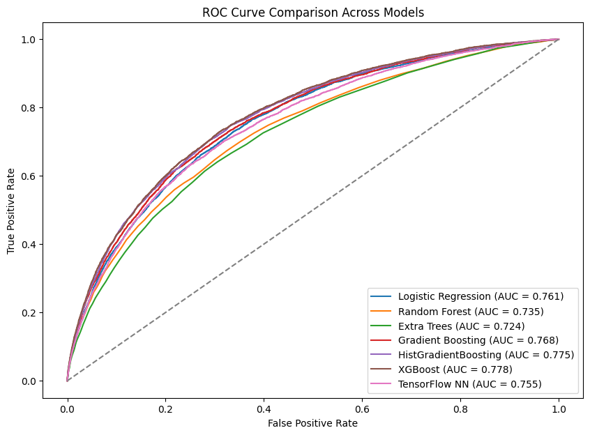
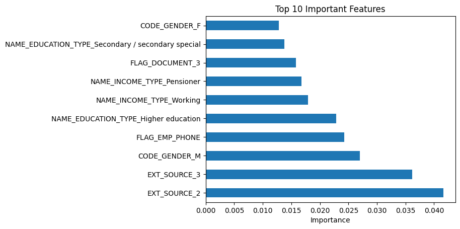

# Home Credit Default Risk

The goal is to predict whether a loan applicant may experience payment difficulties. The project combines applicant information with historical credit, loan, installment, point-of-sale, and credit-card records, then compares several classification models using ROC-AUC.

## Project Highlights

- Preprocessed a large, multi-table financial dataset
- Filled missing numerical values using median imputation
- Converted categorical variables using one-hot encoding
- Created applicant-level features from historical financial tables
- Compared seven machine learning models
- Evaluated performance using ROC-AUC
- Generated a Kaggle submission using the strongest model

## My Contribution

This project was completed by a three-person university team. I was responsible for the complete coding implementation, including:

- Loading and preprocessing the datasets
- Handling missing values and categorical variables
- Creating applicant-level features
- Training and evaluating all machine learning models
- Building the TensorFlow neural network
- Creating the ROC curve and feature-importance visualizations
- Retraining the final XGBoost model
- Generating the Kaggle submission file

My teammates contributed to research, the written report, the presentation, and discussion of the final results.

## Notebook

The notebook is:

```text
HomeCreditDefaultRiskCode.ipynb
```

It is designed to run in **Google Colab** and uses Google Drive for dataset storage.

## Dataset Setup

1. Download the `home-credit-default-risk.zip` competition archive from Kaggle.
2. Upload the ZIP file to the root of **My Drive** in Google Drive.
3. Confirm that the file name is exactly:

```text
home-credit-default-risk.zip
```

4. Open the notebook in Google Colab.
5. Run the cells in order.

The notebook mounts Google Drive and extracts the ZIP using these original paths:

```python
drive.mount("/content/drive")

!unzip "/content/drive/MyDrive/home-credit-default-risk.zip" -d "/content/homerisk"
```

The notebook then expects the extracted files under:

```text
/content/homerisk/
```

## Files Loaded by the Original Notebook

```text
application_train.csv
application_test.csv
bureau.csv
bureau_balance.csv
previous_application.csv
POS_CASH_balance.csv
credit_card_balance.csv
installments_payments.csv
```

`bureau_balance.csv` is loaded by the original notebook but is not used in the final feature-engineering pipeline.

The Kaggle data is not included in this repository.

## Technical Approach

### Preprocessing

- Removed the `TARGET` column from the training features
- Filled missing numerical values with medians
- Applied one-hot encoding with `pandas.get_dummies()`
- Aligned training and test columns
- Filled remaining missing values after feature merging

### Feature Engineering

A reusable `make_features()` function groups historical records by applicant ID (`SK_ID_CURR`) and creates summary statistics such as:

- Mean
- Sum
- Minimum
- Maximum
- Standard deviation

Engineered feature groups include:

- Bureau credit history
- Previous applications
- Point-of-sale and cash-loan balances
- Credit-card balances and payments
- Installment payment behavior

The notebook also creates:

```text
PAYMENT_RATIO = AMT_PAYMENT / AMT_INSTALMENT
```

### Models Compared

- Logistic Regression
- Random Forest
- Gradient Boosting
- Extra Trees
- HistGradientBoosting
- XGBoost
- TensorFlow Neural Network

### Evaluation

The notebook uses an 80/20 stratified train-validation split and evaluates each model with ROC-AUC.

## Results

| Model | Validation ROC-AUC |
|---|---:|
| XGBoost | 0.778 |
| HistGradientBoosting | 0.775 |
| Gradient Boosting | 0.768 |
| Logistic Regression | 0.761 |
| TensorFlow Neural Network | 0.755 |
| Random Forest | 0.735 |
| Extra Trees | 0.724 |

XGBoost produced the strongest validation result and was retrained on the full training dataset to generate `submission.csv`.

## Visualizations

### ROC Curve Comparison



### XGBoost Feature Importance



Feature importance reflects model contribution, not causation.

## Repository Structure

```text
home-credit-default-risk-original-version/
├── README.md
├── HomeCreditDefaultRiskCode.ipynb
├── requirements.txt
├── .gitignore
├── images/
│   ├── roc_curves_comparison.png
│   └── important_features.png
├── reports/
│   └── Home Credit Default Risk Project Report.pdf
└── slides/
    └── Home Credit Default Risk Slides.pptx
```

## Requirements

Google Colab already includes most required packages. The included `requirements.txt` documents the primary Python libraries used by the notebook.

## Limitations

- The notebook is tied to Google Colab and specific Google Drive paths
- Preprocessing occurs before the validation split
- Hyperparameter tuning was limited
- Class imbalance still affects model performance
- The workflow has not been externally validated
- Sensitive variables would require fairness testing before any real-world use

## Responsible Use

This is an educational portfolio project. It is not intended for production lending decisions. A real system would require fairness testing, explainability, privacy safeguards, regulatory review, model monitoring, and human oversight.

## Technologies

Python, Pandas, NumPy, Scikit-learn, XGBoost, TensorFlow/Keras, Matplotlib, Google Colab
